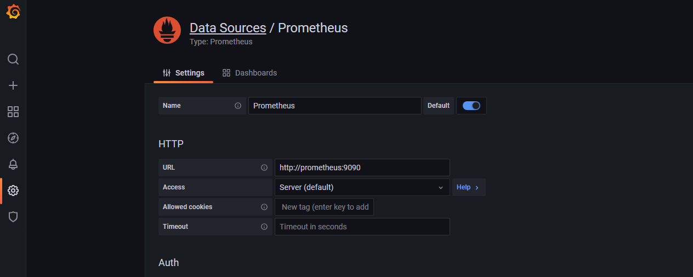
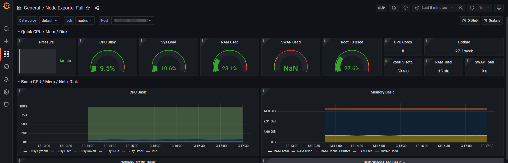
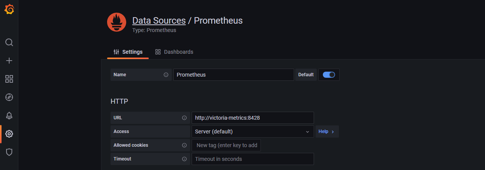
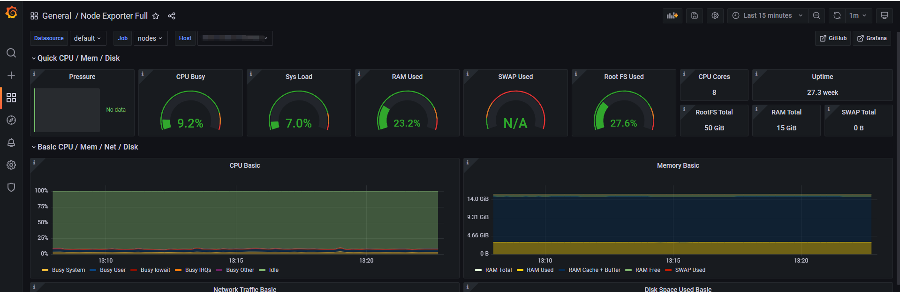
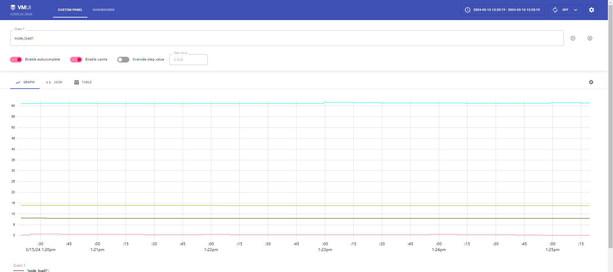
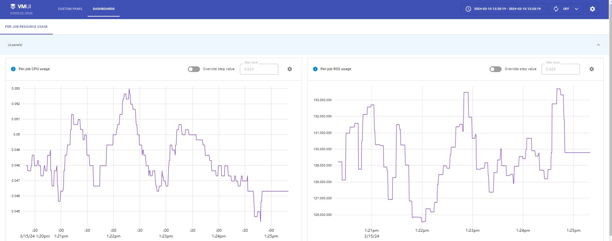

- OAMlab
- https://github.com/oamlab

# 关于部署VictoriaMetrics的概要资料(Overview of deploying VictoriaMetrics)

---

# VictoriaMetrics


## For Install VictoriaMetrics 1.76.1


### 简介

说到云原生监控方案，第一时间基本上都会想到 Prometheus+AlertManager+Grafana 的一套成熟解决方案。 Prometheus 作为监控核心，具备强大的数据模型、高效率运作、丰富的监控能力、强大的查询语言 PromQL、 简单易用、管理方便等特点。但是 Prometheus 目前在高可用层面上做得还并不完美。为此，在开源社区中， 孕育出了许多替代、增强方案，VictoriaMetrics 属于其中较为优异的一个，是一个快速、经济高效且可扩展的监控解决方案和时间序列数据库。

### 特点

1. 它可以作为 Prometheus 的长期储存，且支持 Prometheus 查询 API，可以在 Grafana 中用作 Prometheus 的代替品；
2. 部署简单，无论是单节点版本还是集群版本，都只需要运行所需的组件可执行文件（每个组件都是一个可执行文件），运行前不需要安装任何依赖，易于设置和操作；
3. 使用 vmbackup/vmrestore 工具可以轻松快速地将即时快照备份到 S3 或 GCS；
4. 基于 PromQL 的查询语言实现 MetricsQL，对 PromSQL 进行改造；
5. 读写性能比 InfluxDB 和 TimescaleDB 高达 20 倍；百万时间序列数据下，内存使用比 InfluxDB 少 10 倍， 比 Prometheus、Thanos 或 Cortex 少 7 倍；数据高压缩，与 Prometheus、Thanos 或 Cortex 相比，所需的存储空间最多可减少 7 倍；
6. 具有高延迟 IO 和低 IOPS；
7. 支持从第三方时序数据库获取数据源。

### 软件版本

```yaml
prom/prometheus:v2.31.1
prom/node-exporter:v1.3.1
grafana/grafana:8.3.3
victoriametrics/victoria-metrics:v1.76.1
```

### 操作系统版本

````
CentOS Stream 9 x86 64
https://mirrors.tuna.tsinghua.edu.cn/centos-stream/9-stream/BaseOS/x86_64/iso/CentOS-Stream-9-latest-x86_64-boot.iso
````

### 软件包链接

```
docker pull xxx
```

### 安装过程

#### 架构

VM 分为单节点和集群两个方案，根据业务需求选择即可。单节点版直接运行一个二进制文件既，官方建议采集数据点(data points)低于 100w/s，推荐 VM 单节点版，简单好维护，但不支持告警。集群版支持数据水平拆分。下图是 `VictoriaMetrics` 集群版官方的架构图。


**架构组件如下：**

- vmstorage:  数据存储以及查询结果返回，默认端口为8482
- vminsert:  数据录入，可实现类似分片、副本功能，默认端口8480
- vmselect: 数据查询，汇总和数据去重，默认端口8481
- vmagent: 数据指标抓取，支持多种后端存储，会占用本地磁盘缓存，默认端口8429
- vmalert: 报警相关组件，如果不需要告警功能可以不使用该组件，默认端口为8880 

#### 安装监控

##### 安装node_export

```yaml
apiVersion: apps/v1
kind: DaemonSet
metadata:
  name: node-exporter
  namespace: kube-mon
  labels:
    app: node-exporter
spec:
  selector:
    matchLabels:
      app: node-exporter
  template:
    metadata:
      labels:
        app: node-exporter
    spec:
      hostPID: true
      hostIPC: true
      hostNetwork: true
      nodeSelector:
        kubernetes.io/os: linux
      containers:
        - name: node-exporter
          image: prom/node-exporter:v1.3.1
          args:
            - --web.listen-address=$(HOSTIP):9100
            - --path.procfs=/host/proc
            - --path.sysfs=/host/sys
            - --path.rootfs=/host/root
            - --no-collector.hwmon # 禁用不需要的一些采集器
            - --no-collector.nfs
            - --no-collector.nfsd
            - --no-collector.nvme
            - --no-collector.dmi
            - --no-collector.arp
            - --collector.filesystem.ignored-mount-points=^/(dev|proc|sys|var/lib/containerd/.+|/var/lib/docker/.+|var/lib/kubelet/pods/.+)($|/)
            - --collector.filesystem.ignored-fs-types=^(autofs|binfmt_misc|cgroup|configfs|debugfs|devpts|devtmpfs|fusectl|hugetlbfs|mqueue|overlay|proc|procfs|pstore|rpc_pipefs|securityfs|sysfs|tracefs)$
          ports:
            - containerPort: 9100
          env:
            - name: HOSTIP
              valueFrom:
                fieldRef:
                  fieldPath: status.hostIP
          resources:
            requests:
              cpu: 150m
              memory: 180Mi
            limits:
              cpu: 150m
              memory: 180Mi
          securityContext:
            runAsNonRoot: true
            runAsUser: 65534
          volumeMounts:
            - name: proc
              mountPath: /host/proc
            - name: sys
              mountPath: /host/sys
            - name: root
              mountPath: /host/root
              mountPropagation: HostToContainer
              readOnly: true
      tolerations: # 添加容忍
        - operator: "Exists"
      volumes:
        - name: proc
          hostPath:
            path: /proc
        - name: dev
          hostPath:
            path: /dev
        - name: sys
          hostPath:
            path: /sys
        - name: root
          hostPath:
            path: /
```

##### 配置Prometheus

```yaml
# configmap
apiVersion: v1
kind: ConfigMap
metadata:
  name: prometheus-config
  namespace: kube-mon
data:
  prometheus.yml: |
    global:
      scrape_interval: 15s
      scrape_timeout: 15s
    scrape_configs:
    - job_name: "nodes"
      static_configs:
      - targets: ['x.x.x.x:9100', 'x.x.x.x:9100', 'x.x.x.x:9100','x.x.x.x:9100']
```

##### 安装prometheus

```yaml
# prometheus-deploy.yaml
apiVersion: apps/v1
kind: Deployment
metadata:
  name: prometheus
  namespace: kube-mon
  labels:
    app: prometheus
spec:
  selector:
    matchLabels:
      app: prometheus
  template:
    metadata:
      labels:
        app: prometheus
    spec:
      serviceAccountName: prometheus
      containers:
        - image: prom/prometheus:v2.31.1
          name: prometheus
          args:
            - '--config.file=/etc/prometheus/prometheus.yml'
            - '--storage.tsdb.path=/prometheus' 
            - '--storage.tsdb.retention.time=24h'
            - '--web.enable-admin-api' 
            - '--web.enable-lifecycle' 
          ports:
            - containerPort: 9090
              name: http
          volumeMounts:
            - mountPath: '/etc/prometheus'
              name: config-volume
            - mountPath: '/prometheus'
              name: data
          resources:
            requests:
              cpu: 200m
              memory: 1024Mi
            limits:
              cpu: 200m
              memory: 1024Mi
      volumes:
        - name: data
          persistentVolumeClaim:
            claimName: prometheus-data
        - configMap:
            name: prometheus-config
          name: config-volume
---
apiVersion: v1 
kind: PersistentVolumeClaim
metadata:
  name: prometheus-data
  namespace: kube-mon
spec:
  accessModes:
  - ReadWriteOnce
  resources:
    requests:
      storage: 10Gi
  storageClassName: nfs-csi
```

##### 安装grafana

```yaml
# grafana.yaml
apiVersion: apps/v1
kind: Deployment
metadata:
  name: grafana
  namespace: kube-mon
spec:
  selector:
    matchLabels:
      app: grafana
  template:
    metadata:
      labels:
        app: grafana
    spec:
      containers:
        - name: grafana
          image: grafana/grafana:8.3.3
          imagePullPolicy: IfNotPresent
          ports:
            - containerPort: 3000
              name: grafana
          env:
            - name: GF_SECURITY_ADMIN_USER
              value: admin
            - name: GF_SECURITY_ADMIN_PASSWORD
              value: admin123
          readinessProbe:
            failureThreshold: 10
            httpGet:
              path: /api/health
              port: 3000
              scheme: HTTP
            initialDelaySeconds: 60
            periodSeconds: 10
            successThreshold: 1
            timeoutSeconds: 30
          livenessProbe:
            failureThreshold: 3
            httpGet:
              path: /api/health
              port: 3000
              scheme: HTTP
            periodSeconds: 10
            successThreshold: 1
            timeoutSeconds: 1
          resources:
            limits:
              cpu: 150m
              memory: 512Mi
            requests:
              cpu: 150m
              memory: 512Mi
          volumeMounts:
            - mountPath: '/var/lib/grafana'
              name: storage
      volumes:
        - name: storage
          persistentVolumeClaim:
            claimName: grafana-data
---
apiVersion: v1
kind: Service
metadata:
  name: grafana
  namespace: kube-mon
spec:
  type: NodePort
  ports:
    - port: 3000
  selector:
    app: grafana

---
apiVersion: v1
kind: PersistentVolumeClaim
metadata:
  name: grafana-data
  namespace: kube-mon
spec:
  accessModes:
    - ReadWriteOnce
  resources:
    requests:
      storage: 2Gi
  storageClassName: nfs-csi
```

##### 查看Prometheus采集数据

<p align="center">
	
</p>

<p align="center">
	
</p>

#### 安装victoriaMetrics

##### 安装（单节点）

```yaml
# victoria-metrics.yaml
apiVersion: apps/v1
kind: Deployment
metadata:
  name: victoria-metrics
  namespace: kube-mon
spec:
  selector:
    matchLabels:
      app: victoria-metrics
  template:
    metadata:
      labels:
        app: victoria-metrics
    spec:
      volumes:
        - name: storage
          persistentVolumeClaim:
            claimName: victoria-metrics-data
        - name: prometheus-config
          configMap:
            name: prometheus-config

      containers:
        - name: vm
          image: victoriametrics/victoria-metrics:v1.76.1
          imagePullPolicy: IfNotPresent
          args:
            - -storageDataPath=/var/lib/victoria-metrics-data
            - -retentionPeriod=1w
            - -promscrape.config=/etc/prometheus/prometheus.yml
          ports:
            - containerPort: 8428
              name: http
          volumeMounts:
            - mountPath: /var/lib/victoria-metrics-data
              name: storage
            - mountPath: /etc/prometheus
              name: prometheus-config

---
apiVersion: v1
kind: Service
metadata:
  name: victoria-metrics
  namespace: kube-mon
spec:
  type: NodePort
  ports:
    - port: 8428
  selector:
    app: victoria-metrics

---
apiVersion: v1
kind: PersistentVolumeClaim
metadata:
  name: victoria-metrics-data
  namespace: kube-mon
spec:
  accessModes:
    - ReadWriteOnce
  resources:
    requests:
      storage: 10Gi
  storageClassName: nfs-csi
```

##### victoria-metrics数据存储

```yaml
# tree 
.
├── data
│   ├── big
│   │   ├── 2024_03
│   │   │   ├── tmp
│   │   │   └── txn
│   │   └── snapshots
│   ├── flock.lock
│   └── small
│       ├── 2024_03
│       │   ├── 1605_1605_20240315025309.943_20240315025309.943_17BCCEA14DCB6615
│       │   │   ├── index.bin
│       │   │   ├── metaindex.bin
│       │   │   ├── min_dedup_interval
│       │   │   ├── timestamps.bin
│       │   │   └── values.bin
│       │   ├── 1605_1605_20240315025324.943_20240315025324.943_17BCCEA14DCB6618
│       │   │   ├── index.bin
│       │   │   ├── metaindex.bin
│       │   │   ├── min_dedup_interval
│       │   │   ├── timestamps.bin
│       │   │   └── values.bin
│       │   ├── 178644_8114_20240315023054.943_20240315023718.932_17BCCEA14DCB6558
│       │   │   ├── index.bin
│       │   │   ├── metaindex.bin
│       │   │   ├── min_dedup_interval
│       │   │   ├── timestamps.bin
│       │   │   └── values.bin
│       │   ├── 189006_8114_20240315024332.635_20240315024918.932_17BCCEA14DCB65E7
│       │   │   ├── index.bin
│       │   │   ├── metaindex.bin
│       │   │   ├── min_dedup_interval
│       │   │   ├── timestamps.bin
│       │   │   └── values.bin
│       │   ├── 20489_8114_20240315025024.943_20240315025118.932_17BCCEA14DCB65FF
│       │   │   ├── index.bin
│       │   │   ├── metaindex.bin
│       │   │   ├── min_dedup_interval
│       │   │   ├── timestamps.bin
│       │   │   └── values.bin
│       │   ├── 2520_2520_20240315025313.910_20240315025313.910_17BCCEA14DCB6616
│       │   │   ├── index.bin
│       │   │   ├── metaindex.bin
│       │   │   ├── min_dedup_interval
│       │   │   ├── timestamps.bin
│       │   │   └── values.bin
│       │   ├── 32320_8114_20240315025032.635_20240315025158.910_17BCCEA14DCB6607
│       │   │   ├── index.bin
│       │   │   ├── metaindex.bin
│       │   │   ├── min_dedup_interval
│       │   │   ├── timestamps.bin
│       │   │   └── values.bin
│       │   ├── 32456_8114_20240315025202.635_20240315025258.910_17BCCEA14DCB6613
│       │   │   ├── index.bin
│       │   │   ├── metaindex.bin
│       │   │   ├── min_dedup_interval
│       │   │   ├── timestamps.bin
│       │   │   └── values.bin
│       │   ├── 34061_8114_20240315024839.943_20240315025018.932_17BCCEA14DCB65F3
│       │   │   ├── index.bin
│       │   │   ├── metaindex.bin
│       │   │   ├── min_dedup_interval
│       │   │   ├── timestamps.bin
│       │   │   └── values.bin
│       │   ├── 3989_3989_20240315025302.635_20240315025303.932_17BCCEA14DCB6614
│       │   │   ├── index.bin
│       │   │   ├── metaindex.bin
│       │   │   ├── min_dedup_interval
│       │   │   ├── timestamps.bin
│       │   │   └── values.bin
│       │   ├── 3989_3989_20240315025317.635_20240315025318.932_17BCCEA14DCB6617
│       │   │   ├── index.bin
│       │   │   ├── metaindex.bin
│       │   │   ├── min_dedup_interval
│       │   │   ├── timestamps.bin
│       │   │   └── values.bin
│       │   ├── 612539_8114_20240315021909.943_20240315024328.910_17BCCEA14DCB65A1
│       │   │   ├── index.bin
│       │   │   ├── metaindex.bin
│       │   │   ├── min_dedup_interval
│       │   │   ├── timestamps.bin
│       │   │   └── values.bin
│       │   ├── tmp
│       │   └── txn
│       └── snapshots
├── flock.lock
├── indexdb
│   ├── 17BCCEA04C2F1EB6
│   │   ├── converted-to-v1.28.0
│   │   ├── flock.lock
│   │   ├── tmp
│   │   └── txn
│   ├── 17BCCEA04C2F1EB7
│   │   ├── 14364_21_17BCCEA04E24DD0A
│   │   │   ├── index.bin
│   │   │   ├── items.bin
│   │   │   ├── lens.bin
│   │   │   ├── metadata.json
│   │   │   └── metaindex.bin
│   │   ├── 38784_66_17BCCEA04E24DD09
│   │   │   ├── index.bin
│   │   │   ├── items.bin
│   │   │   ├── lens.bin
│   │   │   ├── metadata.json
│   │   │   └── metaindex.bin
│   │   ├── converted-to-v1.28.0
│   │   ├── flock.lock
│   │   ├── tmp
│   │   └── txn
│   └── snapshots
├── metadata
│   └── minTimestampForCompositeIndex
├── snapshots
└── tmp
    └── searchResults
```

##### 替换数据源victoria-metrics

```
# 关闭Promtheus后在更新数据源
```

<p align="center">
	
</p>

- 数据展示正常，说明victoria-metrics数据正常

<p align="center">
	
</p>

<p align="center">
	
</p>

<p align="center">
	
</p>

##### 安装集群节点

```shell
# 创建ns
kubectl create ns kube-vm	
```

```yaml
# rbac.yml
---
apiVersion: v1
kind: ServiceAccount
metadata:
  name: vmagent-sa
  namespace: kube-vm

---
apiVersion: rbac.authorization.k8s.io/v1
kind: ClusterRole
metadata:
  name: vmagent
rules:
  - apiGroups: ["", "networking.k8s.io", "extensions"]
    resources:
      - nodes
      - nodes/metrics
      - services
      - endpoints
      - endpointslices
      - pods
      - app
      - ingresses
    verbs: ["get", "list", "watch"]
  - apiGroups: [""]
    resources:
      - namespaces
      - configmaps
    verbs: ["get"]
  - nonResourceURLs: ["/metrics", "/metrics/resources"]
    verbs: ["get"]

---
apiVersion: rbac.authorization.k8s.io/v1
kind: ClusterRoleBinding
metadata:
  name: vmagent
roleRef:
  apiGroup: rbac.authorization.k8s.io
  kind: ClusterRole
  name: vmagent
subjects:
  - kind: ServiceAccount
    name: vmagent-sa
    namespace: kube-vm
```

```yaml
# vmstorage.yml
---
apiVersion: v1
kind: Service
metadata:
  # headless 的 service 名称
  name: cluster-vmstorage
  namespace: kube-vm
  labels:
    app: vmstorage
spec:
  type: ClusterIP
  # headless 无头 Service
  clusterIP: None
  selector:
    app: vmstorage
  ports:
    - port: 8482
      targetPort: http
      name: http
    - port: 8401
      targetPort: vmselect
      name: vmselect
    - port: 8400
      targetPort: vminsert
      name: vminsert
---
apiVersion: v1
kind: PersistentVolumeClaim
metadata:
  name: vmstore-local-pvc
  namespace: kube-vm
  labels:
    app: vmstorage
spec:
  storageClassName: nfs-csi
  accessModes:
    - ReadWriteMany
  resources:
    requests:
      storage: 10Gi
---
apiVersion: apps/v1
kind: StatefulSet
metadata:
  name: vmstorage
  namespace: kube-vm
  labels:
    app: vmstorage
spec:
  serviceName: cluster-vmstorage
  selector:
    matchLabels:
      app: vmstorage
  replicas: 2
  podManagementPolicy: OrderedReady
  template:
    metadata:
      labels:
        app: vmstorage
    spec:
      volumes:
        - name: storage
          persistentVolumeClaim:
            claimName: vmstore-local-pvc
      containers:
        - name: vmstorage
          image: "victoriametrics/vmstorage:v1.77.0-cluster"
          imagePullPolicy: "IfNotPresent"
          env:
            - name: POD_NAME
              valueFrom:
                fieldRef:
                  fieldPath: metadata.name
          volumeMounts:
            - name: storage
              mountPath: /storage
          args:
            - "--retentionPeriod=60d"
            # 不同实例接受的数据写入到不同目录
            - "--storageDataPath=/storage/$(POD_NAME)"
            - --envflag.enable=true
            - --envflag.prefix=VM_
            - --loggerFormat=json
            # 清理重复数据，与 scrape_interval 保持一致
            - --dedup.minScrapeInterval=15s
          ports:
            - name: http
              containerPort: 8482
            - name: vminsert
              containerPort: 8400
            - name: vmselect
              containerPort: 8401
          livenessProbe:
            failureThreshold: 10
            initialDelaySeconds: 30
            periodSeconds: 30
            tcpSocket:
              port: http
            timeoutSeconds: 5
          readinessProbe:
            failureThreshold: 3
            initialDelaySeconds: 5
            periodSeconds: 15
            timeoutSeconds: 5
            httpGet:
              path: /health
              port: http
```

```yaml
# vmselect.yaml
---
apiVersion: v1
kind: Service
metadata:
  name: vmselect
  namespace: kube-vm
  labels:
    app: vmselect
spec:
  type: NodePort
  selector:
    app: vmselect
  ports:
    - name: http
      port: 8481
      targetPort: http
---
apiVersion: apps/v1
kind: Deployment
metadata:
  name: vmselect
  namespace: kube-vm
  labels:
    app: vmselect
spec:
  selector:
    matchLabels:
      app: vmselect
  template:
    metadata:
      labels:
        app: vmselect
    spec:
      volumes:
        - name: cache-volume
          emptyDir: {}
      containers:
        - name: vmselect
          image: "victoriametrics/vmselect:v1.77.0-cluster"
          imagePullPolicy: "IfNotPresent"
          volumeMounts:
            - name: cache-volume
              mountPath: /cache
          args:
            - "--cacheDataPath=/cache"
            # 逐一显式指明 vmstorage 节点地址
            - --storageNode=vmstorage-0.cluster-vmstorage.kube-vm.svc.cluster.local:8401
            - --storageNode=vmstorage-1.cluster-vmstorage.kube-vm.svc.cluster.local:8401
            - --envflag.enable=true
            - --envflag.prefix=VM_
            - --loggerFormat=json
            # 清理重复数据，与 scrape_interval 保持一致
            - --dedup.minScrapeInterval=15s
          ports:
            - name: http
              containerPort: 8481
          readinessProbe:
            httpGet:
              path: /health
              port: http
            initialDelaySeconds: 5
            periodSeconds: 15
            timeoutSeconds: 5
            failureThreshold: 3
          livenessProbe:
            tcpSocket:
              port: http
            initialDelaySeconds: 5
            periodSeconds: 15
            timeoutSeconds: 5
            failureThreshold: 3
````

```yaml
# vminsert.yaml
---
apiVersion: v1
kind: Service
metadata:
  name: vmselect
  namespace: kube-vm
  labels:
    app: vmselect
spec:
  type: NodePort
  selector:
    app: vmselect
  ports:
    - name: http
      port: 8481
      targetPort: http
---
apiVersion: apps/v1
kind: Deployment
metadata:
  name: vmselect
  namespace: kube-vm
  labels:
    app: vmselect
spec:
  selector:
    matchLabels:
      app: vmselect
  template:
    metadata:
      labels:
        app: vmselect
    spec:
      volumes:
        - name: cache-volume
          emptyDir: {}
```

```shell
[root@FVK8S-KFCS941 cluster-vm]# ls
rbac.yaml  storage.yaml  vmagent-cm.yaml  vmagent.yaml  vminsert.yaml  vmselect.yaml
[root@FVK8S-KFCS941 cluster-vm]# 
[root@FVK8S-KFCS941 cluster-vm]# cat vminsert.yaml  
```
```yaml
---
apiVersion: v1
kind: Service
metadata:
  name: vminsert
  namespace: kube-vm
  labels:
    app: vminsert
spec:
  type: ClusterIP
  selector:
    app: vminsert
  ports:
    - name: http
      port: 8480
      targetPort: http

---
apiVersion: apps/v1
kind: Deployment
metadata:
  name: vminsert
  namespace: kube-vm
  labels:
    app: vminsert
spec:
  selector:
    matchLabels:
      app: vminsert
  template:
    metadata:
      labels:
        app: vminsert
    spec:
      containers:
        - name: vminsert
          image: "victoriametrics/vminsert:v1.77.0-cluster"
          imagePullPolicy: "IfNotPresent"
          args:
            # 与 vmselect 一样，逐一指明 vmstore Pod 地址
            - --storageNode=vmstorage-0.cluster-vmstorage.kube-vm.svc.cluster.local:8400
            - --storageNode=vmstorage-1.cluster-vmstorage.kube-vm.svc.cluster.local:8400
            - --envflag.enable=true
            - --envflag.prefix=VM_
            - --loggerFormat=json
          ports:
            - name: http
              containerPort: 8480
          readinessProbe:
            httpGet:
              path: /health
              port: http
            initialDelaySeconds: 5
            periodSeconds: 15
            timeoutSeconds: 5
            failureThreshold: 3
          livenessProbe:
            tcpSocket:
              port: http
            initialDelaySeconds: 5
            periodSeconds: 15
            timeoutSeconds: 5
            failureThreshold: 3
```

```yaml
# configmap-vmagent-config.yml
apiVersion: v1
kind: ConfigMap
metadata:
  # name: vmagent-config
  name: configmap-vmagent-config
  namespace: kube-vm
data:
  scrape.yml: |
    global:
      scrape_interval: 15s
      scrape_timeout: 15s

    scrape_configs:
    - job_name: nodes
      kubernetes_sd_configs:
        - role: node
      relabel_configs:
      # 修改默认 10250 端口采集为 自定义的 node_exporter 9110 端口
      - source_labels: [__address__]
        regex: "(.*):10250"
        replacement: "${1}:9100"
        target_label: __address__
        action: replace
      # # 映射 Node 的 Label 标签
      - action: labelmap
        regex: __meta_kubernetes_node_label_(.+)

    - job_name: apiserver
      scheme: https
      bearer_token_file: /var/run/secrets/kubernetes.io/serviceaccount/token
      tls_config:
        ca_file: /var/run/secrets/kubernetes.io/serviceaccount/ca.crt
        insecure_skip_verify: true
      kubernetes_sd_configs:
      - role: endpoints
      relabel_configs:
      - action: keep
        # 根据正则过滤出 apiserver 服务组件的 endpoint
        regex: apiserver
        source_labels: [__meta_kubernetes_service_label_component]

    - job_name: cadvisor
      bearer_token_file: /var/run/secrets/kubernetes.io/serviceaccount/token
      scheme: https
      tls_config:
        ca_file: /var/run/secrets/kubernetes.io/serviceaccount/ca.crt
        # 跳过证书校验
        insecure_skip_verify: true
      kubernetes_sd_configs:
      - role: node
      relabel_configs:
      - action: labelmap
        regex: __meta_kubernetes_node_label_(.+)
      - replacement: /metrics/cadvisor
        target_label: __metrics_path__

    - job_name: pod
      kubernetes_sd_configs:
      - role: endpoints
      relabel_configs:
      - action: drop
        regex: true
        source_labels:
        - __meta_kubernetes_pod_container_init
      # 用以判断注解提供的端口，是否匹配容器暴露的端口，避免编写时端口不一致，导致采集失败
      - action: keep_if_equal
        source_labels:
        - __meta_kubernetes_service_annotation_prometheus_io_port
        - __meta_kubernetes_pod_container_port_number
      - action: keep
        regex: true
        source_labels:
        - __meta_kubernetes_service_annotation_prometheus_io_scrape
      # 匹配 http、https 格式的协议头，替换到 __scheme__ 标签，用以抓取数据时使用正确的协议
      - action: replace
        regex: (https?)
        source_labels:
        - __meta_kubernetes_service_annotation_prometheus_io_scheme
        target_label: __scheme__
      # 匹配路径，替换到 __scheme__ 标签，用以抓取数据时使用正确的路径
      - action: replace
        regex: (.+)
        source_labels:
        - __meta_kubernetes_service_annotation_prometheus_io_path
        target_label: __metrics_path__
      # 通过注解获取地址、端口
      - action: replace
        # ([^:]+) 非:开头出现一到多次，匹配 IP 地址
        # (?::\d+)? 不保存子组，:\d+，匹配 :port 出现 0 到 1次
        # (\d+) 端口
        regex: ([^:]+)(?::\d+)?;(\d+)
        # 根据匹配分组生成新数据
        replacement: $1:$2
        source_labels:
        - __address__
        - __meta_kubernetes_service_annotation_prometheus_io_port
        # 使用包含新地址数据的 __address__ 标签采集数据
        target_label: __address__
      # 标签映射，将符合规则的多个标签，统一映射出来
      - action: labelmap
        regex: __meta_kubernetes_service_label_(.+)
      # 生成包含 pod 名称的 pod 标签，用以标识数据属于那个 pod
      - source_labels:
        - __meta_kubernetes_pod_name
        target_label: pod
      # 生成包含命名空间名称的 namespace 标签，用以标识数据属于那个 命名空间
      - source_labels:
        - __meta_kubernetes_namespace
        target_label: namespace
      # 生成包含服务名称的 service 标签，用以标识数据属于那个服务
      - source_labels:
        - __meta_kubernetes_service_name
        target_label: service
      - replacement: ${1}
        source_labels:
        - __meta_kubernetes_service_name
        target_label: job
      # 生成包含节点名称的 node 标签，用以标识数据属于那个 宿主机节点
      - action: replace
        source_labels:
        - __meta_kubernetes_pod_node_name
        target_label: node
```

```yaml
# vmagent.yaml
---
apiVersion: v1
kind: PersistentVolumeClaim
metadata:
  name: vmagent-pvc
  namespace: kube-vm
  labels:
    app: vmagent
spec:
  storageClassName: nfs-csi
  accessModes:
    - ReadWriteMany
  resources:
    requests:
      storage: 2Gi


---
apiVersion: v1
kind: Service
metadata:
  name: vmagent
  namespace: kube-vm
  annotations:
    # 设置注解，用以自动发现并采集自身指标
    prometheus.io/scrape: "true"
    prometheus.io/port: "8429"
spec:
  selector:
    app: vmagent
  # 无头服务，用以发现 vmagent 实例
  clusterIP: None
  ports:
    - name: http
      port: 8429
      targetPort: http
---
apiVersion: apps/v1
kind: StatefulSet
metadata:
  name: vmagent
  namespace: kube-vm
  labels:
    app: vmagent
spec:
  replicas: 2
  serviceName: vmagent
  selector:
    matchLabels:
      app: vmagent
  template:
    metadata:
      labels:
        app: vmagent
    spec:
      serviceAccountName: vmagent-sa
      volumes:
        - name: config
          configMap:
            name: configmap-vmagent-config
        - name: tmpdata
          persistentVolumeClaim:
            claimName: vmagent-pvc
      containers:
        - name: agent
          image: victoriametrics/vmagent:v1.77.0
          imagePullPolicy: IfNotPresent
          env:
            - name: POD_NAME
              valueFrom:
                fieldRef:
                  fieldPath: metadata.name
          volumeMounts:
            - name: tmpdata
              mountPath: /tmpData
            - name: config
              mountPath: /config
          args:
            - -promscrape.config=/config/scrape.yml
            # 当后端 insert 节点不可用时，临时写到该目录，insert 恢复可用后，再继续同步
            # 由于使用的是 LocalPath 所以这里用 $(POD_NAME) 分开一下
            - -remoteWrite.tmpDataPath=/tmpData/$(POD_NAME)
            # vmagent 实例的数量
            - -promscrape.cluster.membersCount=2
            # - -promscrape.cluster.replicationFactor=2 # 可以配置副本数
            # vmagent 实例成员 ID
            - -promscrape.cluster.memberNum=$(POD_NAME)
            - -remoteWrite.url=http://vminsert:8480/insert/0/prometheus
            # 允许提供环境变量设置参数
            - -envflag.enable=true
            # 环境变量前缀设置
            - -envflag.prefix=VM_
            - -loggerFormat=json
          ports:
            - name: http
              containerPort: 8429
```

##### 安装alertmanager

```yaml
# alertmanager
apiVersion: v1
kind: ConfigMap
metadata:
  name: alert-config
  namespace: kube-vm
data:
  config.yml: |-
    global:
      resolve_timeout: 5m
    route:
      group_by: ['severity','cluster']
      group_wait: 30s
      group_interval: 2m
      repeat_interval: 2m
      receiver: webhook
    receivers:
    - name: 'webhook'
      webhook_configs:
      - url: http://xxxxx:8080/prometheusalert?type=webhook&tpl=prometheus-webhook&webhookurl=http://xxxx:8080
        send_resolved: true

---
apiVersion: apps/v1
kind: Deployment
metadata:
  name: alertmanager
  namespace: kube-system
  labels:
    app: alertmanager
spec:
  selector:
    matchLabels:
      app: alertmanager
  template:
    metadata:
      labels:
        app: alertmanager
    spec:
      volumes:
        - name: cfg
          configMap:
            name: alert-config
      containers:
        - name: alertmanager
          image: alertmanager:v0.22.00
          imagePullPolicy: IfNotPresent
          args:
            - "--config.file=/etc/alertmanager/config.yml"
          ports:
            - containerPort: 9093
              name: http
          volumeMounts:
            - mountPath: "/etc/alertmanager"
              name: cfg
```

##### 安装vmalert

- vmalert configmap

```yaml
# vmalert-config.yaml
apiVersion: v1
kind: ConfigMap
metadata:
  name: vmalert-config
  namespace: kube-system
data:
  rules.yaml: |
    groups:
    - name: alertRlues
      rules:
      - alert: NFS磁盘可用空间告警
        expr: floor((node_filesystem_avail_bytes{server=~'nfs', fstype=~"ext.*|xfs", mountpoint=~"/nfs"}-0) / 1073741824) < 200
        for: 1m
        labels:
          severity: 1
          source: node
        annotations:
          summary: "主机 {{ $labels.host_ip }} 挂载点 {{ $labels.mountpoint }} 磁盘可用空间小于200GiB 当前值为: {{ $value }}GB"
          type: "1"
          agent: "vmalert"
```

- vmalert Deployment

```yaml
---
apiVersion: apps/v1
kind: Deployment
metadata:
  name: vmalert
  namespace: kube-system
  labels:
    app: vmalert
spec:
  selector:
    matchLabels:
      app: vmalert
  template:
    metadata:
      labels:
        app: vmalert
    spec:
      containers:
        - name: vmalert
          image: vmalert:v1.77.00
          imagePullPolicy: IfNotPresent
          args:                                 # vmstorage存储配置
            - -rule=/etc/ruler/*.yaml
            - -datasource.url=http://xxxx:8481/select/0/prometheus
            - -notifier.url=http://xxxxx:9093   # 吐给alertmanager
            - -remoteWrite.url=http://xxxx:8480/insert/0/prometheus
            - -evaluationInterval=15s
            - -httpListenAddr=0.0.0.0:8080
          volumeMounts:
            - mountPath: /etc/ruler/
              name: ruler
              readOnly: true
      volumes:
        - configMap:
            name: vmalert-config
          name: ruler
```

#### 备份与恢复

victoria-metrics 提供了与备份相关的两个二进制程序

- **vmbackup**：负责从快照从生成备份数据，如果目标目录已有备份，则自动使用增量方式备份
- **vmrestore**：负责从备份数据还原指标数据

victoria-metrics 备份操作过程主要就是两步

- 通过 http api 创建快照
- 通过 二进制程序生成备份数据

##### 创建快照

victoria-metrics 提供了 http api，这里需要先获取各 vmstorage pod 的 ip

```shell
# 请求vmstorage pod ip创建快照
[root@aaa ~]# curl  10.0.2.211:8482/snapshot/create
{"status":"ok","snapshot":"20240321061424-17BDCF2E8FE38CB0"}
```

```shell
kubectl logs -f -n kube-vm vmstorage-0 
...

{"ts":"2024-03-21T06:14:25.090Z","level":"info","caller":"VictoriaMetrics/lib/storage/partition.go:1625","msg":"created partition snapshot of \"/storage/vmstorage-0/data/small/2024_03\" and \"/storage/vmstorage-0/data/big/2024_03\" at \"/storage/vmstorage-0/data/small/snapshots/20240321061424-17BDCF2E8FE38CB0/2024_03\" and \"/storage/vmstorage-0/data/big/snapshots/20240321061424-17BDCF2E8FE38CB0/2024_03\" in 0.219 seconds"}
{"ts":"2024-03-21T06:14:25.091Z","level":"info","caller":"VictoriaMetrics/lib/storage/table.go:173","msg":"created table snapshot for \"/storage/vmstorage-0/data\" at (\"/storage/vmstorage-0/data/small/snapshots/20240321061424-17BDCF2E8FE38CB0\", \"/storage/vmstorage-0/data/big/snapshots/20240321061424-17BDCF2E8FE38CB0\") in 0.223 seconds"}
{"ts":"2024-03-21T06:14:25.093Z","level":"info","caller":"VictoriaMetrics/lib/mergeset/table.go:1146","msg":"creating Table snapshot of \"/storage/vmstorage-0/indexdb/17BDCF2E8FE808FC\"..."}
{"ts":"2024-03-21T06:14:25.131Z","level":"info","caller":"VictoriaMetrics/lib/mergeset/table.go:1215","msg":"created Table snapshot of \"/storage/vmstorage-0/indexdb/17BDCF2E8FE808FC\" at \"/storage/vmstorage-0/indexdb/snapshots/20240321061424-17BDCF2E8FE38CB0/17BDCF2E8FE808FC\" in 0.039 seconds"}
{"ts":"2024-03-21T06:14:25.132Z","level":"info","caller":"VictoriaMetrics/lib/mergeset/table.go:1146","msg":"creating Table snapshot of \"/storage/vmstorage-0/indexdb/17BDCF2E8FE808FB\"..."}
{"ts":"2024-03-21T06:14:25.134Z","level":"info","caller":"VictoriaMetrics/lib/mergeset/table.go:1215","msg":"created Table snapshot of \"/storage/vmstorage-0/indexdb/17BDCF2E8FE808FB\" at \"/storage/vmstorage-0/indexdb/snapshots/20240321061424-17BDCF2E8FE38CB0/17BDCF2E8FE808FB\" in 0.003 seconds"}
{"ts":"2024-03-21T06:14:25.139Z","level":"info","caller":"VictoriaMetrics/lib/storage/storage.go:387","msg":"created Storage snapshot for \"/storage/vmstorage-0\" at \"/storage/vmstorage-0/snapshots/20240321061424-17BDCF2E8FE38CB0\" in 0.273 seconds"}
```

##### 查看快照

```shell
[root@aaa ~]# curl  10.0.2.211:8482/snapshot/list
{"status":"ok","snapshots":[
"20240321061424-17BDCF2E8FE38CB0"
```

##### 查看数据

```shell
├── metadata
│   └── minTimestampForCompositeIndex
└── snapshots
    └── 20240321061424-17BDCF2E8FE38CB0
        ├── data
        │   ├── big -> ../../../data/big/snapshots/20240321061424-17BDCF2E8FE38CB0
        │   └── small -> ../../../data/small/snapshots/20240321061424-17BDCF2E8FE38CB0
        ├── indexdb -> ../../indexdb/snapshots/20240321061424-17BDCF2E8FE38CB0
        └── metadata
            └── minTimestampForCompositeIndex
```

##### 执行全量备份

```shell
# 下载vmbackup、vmrestore
chmod +x vmbackup  vmrestore
mv vmbackup  vmrestore  /usr/local/bin/
```

```shell
# 全量备份
[root@aaa ~]vmbackup -storageDataPath=/data/k8s/kube-vm-vmstore-local-pvc-pvc-18b6186a-8401-49dc-ad61-d4c47ce8fc05/vmstorage-0 -snapshotName=20240321061424-17BDCF2E8FE38CB0 -dst=fs:///data/k8s/vmstorage-0/

2024-03-21T07:14:11.921Z        info    VictoriaMetrics/lib/logger/flag.go:12   build version: vmbackup-20230407-010908-tags-v1.90.0 -0-gb5d18c0d2
2024-03-21T07:14:11.921Z        info    VictoriaMetrics/lib/logger/flag.go:13   command-line flags
2024-03-21T07:14:11.921Z        info    VictoriaMetrics/lib/logger/flag.go:20     -dst="fs:///data/k8s/vmstorage-0/"
2024-03-21T07:14:11.921Z        info    VictoriaMetrics/lib/logger/flag.go:20     -snapshotName="20240321061424-17BDCF2E8FE38CB0"
2024-03-21T07:14:11.921Z        info    VictoriaMetrics/lib/logger/flag.go:20     -storageDataPath="/data/k8s/kube-vm-vmstore-local-                                                                                                     pvc-pvc-18b6186a-8401-49dc-ad61-d4c47ce8fc05/vmstorage-0"
2024-03-21T07:14:11.922Z        info    VictoriaMetrics/lib/backup/actions/backup.go:78 starting backup from fslocal "/data/k8s/kube  -vm-vmstore-local-pvc-pvc-18b6186a-8401-49dc-ad61-d4c47ce8fc05/vmstorage-0/snapshots/20240321061424-17BDCF2E8FE38CB0" to fsremote "/ data/k8s/vmstorage-0/" using origin fsnil
2024-03-21T07:14:11.922Z        info    VictoriaMetrics/lib/httpserver/httpserver.go:96 starting http server at http://127.0.0.1:842                                                                                                     0/
2024-03-21T07:14:11.922Z        info    VictoriaMetrics/lib/httpserver/httpserver.go:97 pprof handlers are exposed at http://127.0.0                                                                                                     .1:8420/debug/pprof/
2024-03-21T07:14:11.928Z        info    VictoriaMetrics/lib/backup/actions/backup.go:84 obtained 208 parts from src fslocal "/data/k8s/kube-vm-vmstore-local-pvc-pvc-18b6186a-8401-49dc-ad61-d4c47ce8fc05/vmstorage-0/snapshots/20240321061424-17BDCF2E8FE38CB0"
2024-03-21T07:14:11.928Z        info    VictoriaMetrics/lib/backup/actions/backup.go:90 obtained 0 parts from dst fsremote "/data/k8s/vmstorage-0/"
2024-03-21T07:14:11.928Z        info    VictoriaMetrics/lib/backup/actions/backup.go:96 obtained 0 parts from origin fsnil
2024-03-21T07:14:11.929Z        info    VictoriaMetrics/lib/backup/actions/backup.go:149        uploading 208 parts from src fslocal     "/data/k8s/kube-vm-vmstore-local-pvc-pvc-18b6186a-8401-49dc-ad61-d4c47ce8fc05/vmstorage-0/snapshots/20240321061424-17BDCF2E8FE38CB0 " to dst fsremote "/data/k8s/vmstorage-0/"
.....

2024-03-21T07:14:12.103Z        info    VictoriaMetrics/lib/backup/actions/backup.go:179        backup from src fslocal "/data/k8s/kube-vm-vmstore-local-pvc-pvc-18b6186a-8401-49dc-ad61-d4c47ce8fc05/vmstorage-0/snapshots/20240321061424-17BDCF2E8FE38CB0" to dst fsre mote "/data/k8s/vmstorage-0/" with origin fsnil is complete; backed up 142761643 bytes in 0.182 seconds; deleted 0 bytes; server-side copied 0 bytes; uploaded 142761643 bytes
2024-03-21T07:14:12.103Z        info    VictoriaMetrics/app/vmbackup/main.go:108  gracefully shutting down http server for metrics at":8420"
2024-03-21T07:14:12.104Z        info    VictoriaMetrics/app/vmbackup/main.go:112        successfully shut down http server for metrics in 0.000 seconds
```

##### 查看全量备份

```bash
cd /data/k8s/vmstorage-0

tree -L 3 
.
├── backup_complete.ignore
├── data
│   └── small
│       └── 2024_03
├── indexdb
│   ├── 17BDCF2E8FE808FB
│   │   └── converted-to-v1.28.0
│   └── 17BDCF2E8FE808FC
│       ├── 1564_3_17BDCF2E9216550C
│       ├── 15984_32_17BDCF2E92165490
│       ├── 2676_5_17BDCF2E921654EF
│       ├── 302945_785_17BDCF2E92164990
│       ├── 37_1_17BDCF2E92165508
│       ├── 5991_12_17BDCF2E921654D6
│       ├── 91440_189_17BDCF2E92165378
│       └── converted-to-v1.28.0
└── metadata
    └── minTimestampForCompositeIndex
        └── 0000000000000008_0000000000000000_0000000000000008

17 directories, 2 files
```

##### 模拟故障

```bash
#数据丢失
$ rm -rf /data/k8s/kube-vm-vmstore-local-pvc-pvc-18b6186a-8401-49dc-ad61-d4c47ce8fc05/vmstorage-0/*
$ rm -rf /data/k8s/kube-vm-vmstore-local-pvc-pvc-18b6186a-8401-49dc-ad61-d4c47ce8fc05/vmstorage-1/*
$ tree
.
├── vmstorage-0
└── vmstorage-1
```

##### 回滚数据

```shell 

[root@aaa ]# vmrestore  -src=fs:///data/k8s/vmstorage-0/ -storageDataPath=/data/k8s/kube-vm-vmstore-local-pvc-pvc-18b6186a-8401-49dc-ad61-d4c47ce8fc05/vmstorage-0/
2024-03-21T07:51:47.858Z        info    VictoriaMetrics/lib/logger/flag.go:12   build version: vmrestore-20230407-011039-tags-v1.90.0-0-gb5d18c0d2
2024-03-21T07:51:47.858Z        info    VictoriaMetrics/lib/logger/flag.go:13   command-line flags
2024-03-21T07:51:47.858Z        info    VictoriaMetrics/lib/logger/flag.go:20     -src="fs:///data/k8s/vmstorage-0/"
2024-03-21T07:51:47.858Z        info    VictoriaMetrics/lib/logger/flag.go:20     -storageDataPath="/data/k8s/kube-vm-vmstore-local-pvc-pvc-18b6186a-8401-49dc-ad61-d4c47ce8fc05/vmstorage-0/"
2024-03-21T07:51:48.092Z        info    VictoriaMetrics/lib/backup/actions/restore.go:195       restored 142761643 bytes from backup in 0.233 seconds; deleted 14588950 bytes; downloaded 142761635 bytes
2024-03-21T07:51:48.092Z        info    VictoriaMetrics/app/vmrestore/main.go:64        gracefully shutting down http server for metrics at ":8421"
2024-03-21T07:51:48.092Z        info    VictoriaMetrics/app/vmrestore/main.go:68        successfully shut down http server for metrics in 0.000 seconds


#其他节点备份
#vmrestore  -src=fs:///data/k8s/vmstorage-1/ -storageDataPath=/data/k8s/kube-vm-vmstore-local-pvc-pvc-18b6186a-8401-49dc-ad61-d4c47ce8fc05/vmstorage-1/
```

## 其他FAQ
- 相关文件路径
- 启动和停止
- 使用方法
- 管理面板
- 计划任务
